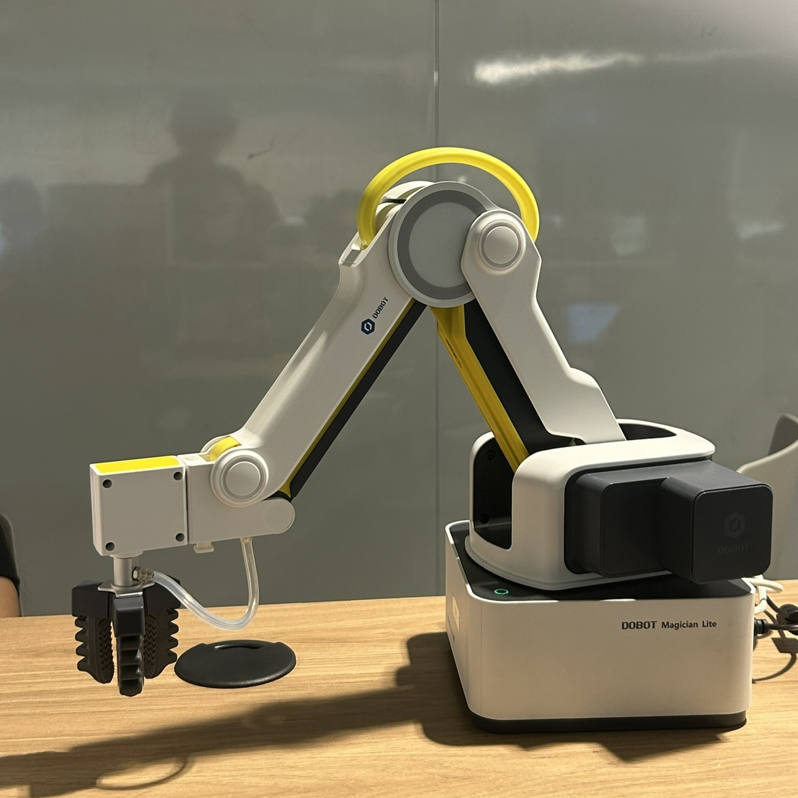
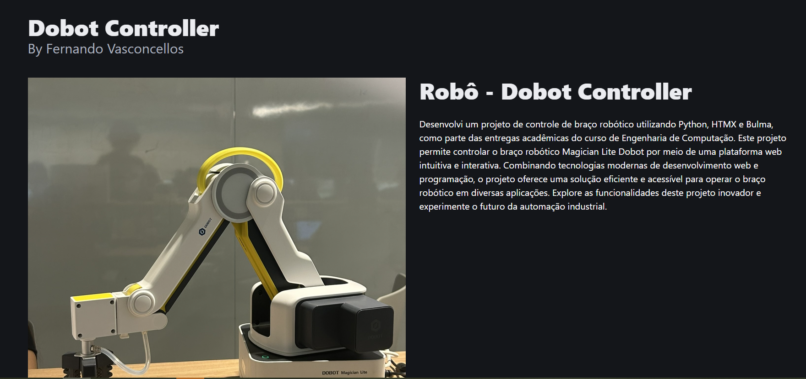
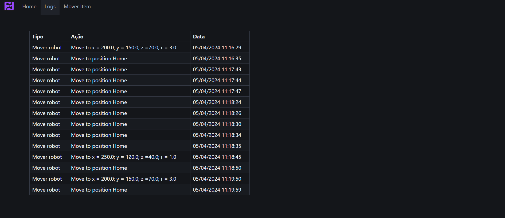
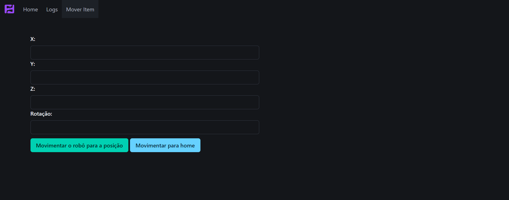

# Dobot Controller Project
### By Fernando Vasconcellos

Desenvolvi um projeto de controle de braço robótico utilizando Python, HTMX e Bulma, como parte das entregas acadêmicas do curso de Engenharia de Computação. Este projeto permite controlar o braço robótico Magician Lite Dobot por meio de uma plataforma web intuitiva e interativa. Combinando tecnologias modernas de desenvolvimento web e programação, o projeto oferece uma solução eficiente e acessível para operar o braço robótico em diversas aplicações. Explore as funcionalidades deste projeto inovador e experimente o futuro da automação industrial.

## Demonstração

Confira o vídeo abaixo para uma demonstração completa do projeto de controle de braço robótico utilizando Python, HTMX e Bulma. Veja como é possível controlar o braço robótico Magician Lite Dobot por meio de uma plataforma web intuitiva e interativa. Descubra as funcionalidades inovadoras e experimente o futuro da automação industrial.

[](https://youtu.be/syuFudSV5qA)

## Como rodar?

Para rodar a aplicação, siga os passos abaixo:

1. Certifique-se de ter o Python instalado em sua máquina.
2. Clone este repositório em seu ambiente local.
3. Crie um ambiente virtual para isolar as dependências do projeto. Execute os seguintes comandos no diretório raiz do projeto:

    ```bash
    cd Flask-Htmx/
    python -m venv venv
    ```

4. Ative o ambiente virtual. No Windows, execute o seguinte comando:

    ```bash
    venv\Scripts\activate
    ```

    No macOS, Linux e no Bash, execute o seguinte comando:

    ```bash
    source venv/bin/activate
    ```

5. Instale as dependências do projeto. Execute o seguinte comando:

    ```bash
    pip install -r requirements.txt
    ```

6. Inicie a aplicação. Execute o seguinte comando:

    ```bash
    flask run 
    ```

7. Acesse a aplicação no seu navegador através do seguinte endereço: `http://localhost:5000`.

## Interface

#### Tela Principal

A tela contém uma breve descrição do projeto com uma imagem do braço mecânico utilizado 




#### Tela de Logs

Essa tela serve como registro de todas as ações executadas através da plataforma, armazenando todas as movimentações realizadas.



#### Tela de Movimentação 

Essa tela contém as funcionalidades de movimentação do robô, sendo elas as: mover para home e mover para uma posição determinada.

